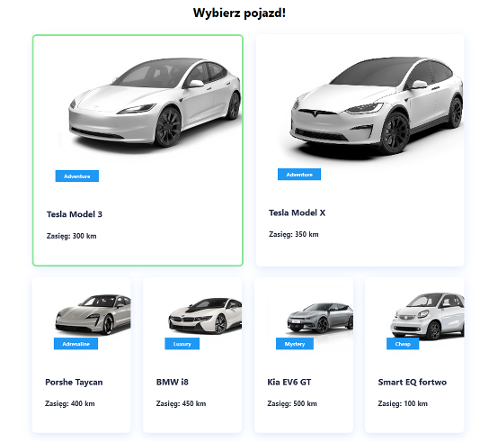

[Polski](readme/README_PL.md)
# Electric cars routing

**Technologies**  
JavaScript + React.js, MaterialUI, Neo4J, npm

SPA to routing electrical cars. 
Allows find the shortest route between two cities for specific car. 
Routing process include car range, so if range is short, car need more stops in cities or chargers (track be longer). 
Moreover, user can add of remove chargers between cities.

&copy; Łukasz Wysocki https://github.com/Lukas976  
Sebastian Dreszer (it's me!)  
January - February 2024

**Launching**
1. Download project from repo
2. Install Node.js (contains npm)
3. Go to project folder
4. Open command line
5. Enter `npm install` to install libraries
6. Enter `npm install react-scripts` to install React
7. Enter `npm start` to run application. Default is running on `localhost:3000`
8. Database is placed in cloud, so don't need installing and configuration (but in free version Neo4J Aura base is removing after 30 days, so sometimes is not available)

Welcome screen 

Car choose 

City choose 

Shortest route between Siedlce [_county city east of Warsaw_] and Szczecin [_provincial city on north-west Poland_] for Tesla Model 3 

Charger adding 
