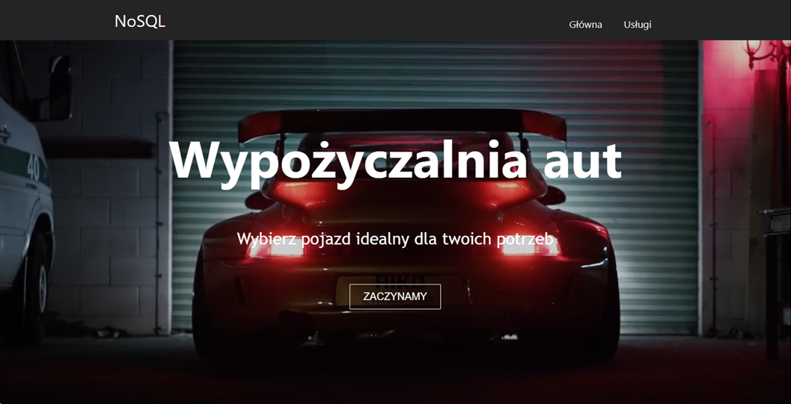
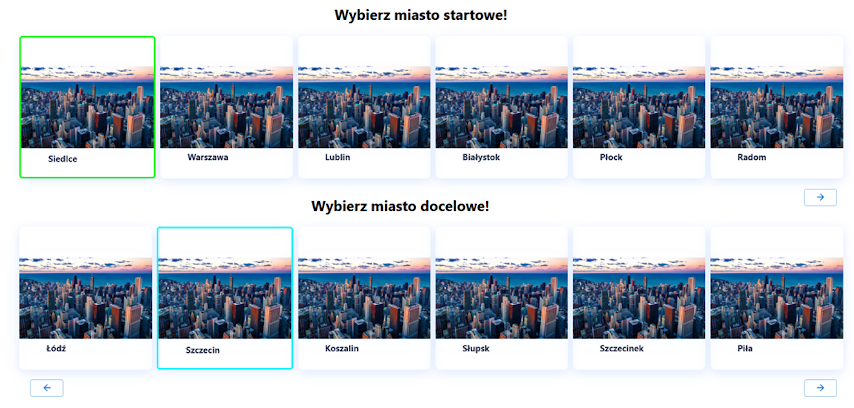

[English](../README.md)
# Trasowanie samochodów elektrycznych
_Tak, takie słowo istnieje i oznacza szukanie trasy_ :)  
**Technologie**  
JavaScript + React.js, MaterialUI, Neo4J, npm

SPA do szukania tras dla elektrycznych samochodów. Pozwala znaleźć najkrótszą drogę między dwoma miastami dla konkretnego pojazdu. 
Proces wyszukiwania uwzględnia zasięg pojazdu, więc jeśli jest krótki, samochód będzie potrzebował więcej postojów w miastach lub ładowarkach (trasa będzie dłuższa).  
Ponadto użytkownik może dodać lub usunąć ładowarkę między miastami (bo miasta raczej się nie przemieszczają, żeby je też trzeba było modyfikować ;) ).

&copy; Łukasz Wysocki https://github.com/Lukas976  
Sebastian Dreszer (to ja!)  
Styczeń — Luty 2024

**Uruchamianie**
1. Pobieramy projekt z repozytorium
2. Instalujemy Node.js (zawiera npm)
3. Idziemy do folderu z projektem
4. Otwieramy wiersz polecenia
5. Wpisujemy `npm install` aby zainstalować biblioteki
6. Wpisujemy `npm install react-scripts` aby zainstalować Reacta
7. Następnie `npm start` aby uruchomić aplikację. Domyślnie uruchamia się na `localhost:3000`
8. Baza danych jest umieszczona w chmurze, więc nie jest wymagana jej instalacja i konfiguracja (ale w darmowej wersji Neo4J Aura baza jest usuwana po 30 dniach, więc czasami jest niedostępna)

Ekran powitalny 

Wybór samochodu 

Wybór miast 

Najkrótsza droga między Siedlcami a Szczecinem dla Tesli Model 3 

Dodawanie ładowarki 
